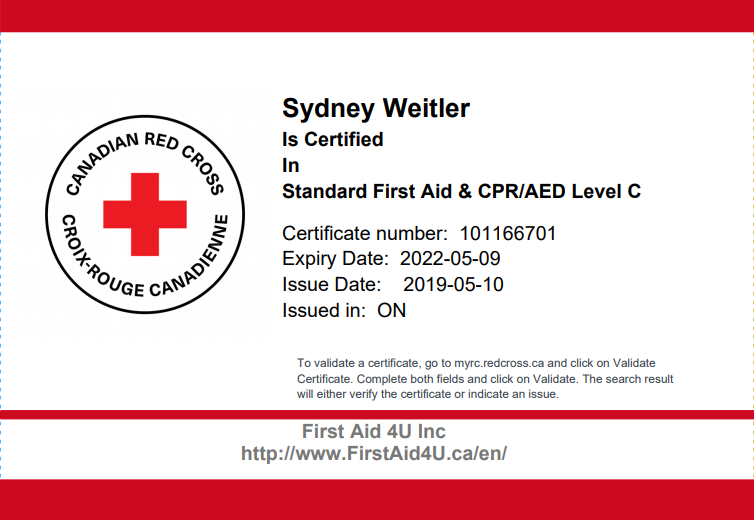
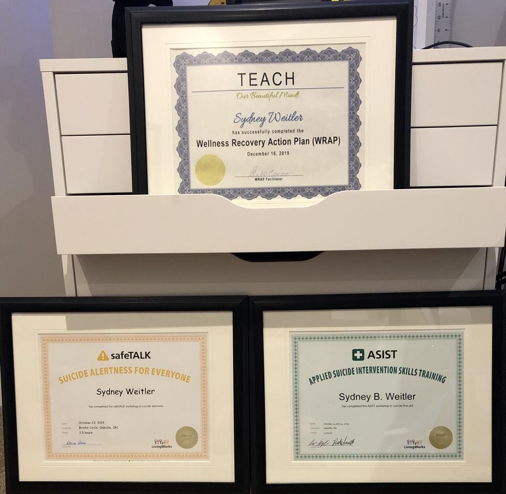

I was very thankful to have the opportunity to complete my CPR/AED Level C with First Aid 4 U who works in partnership with the Canadian Red Cross. I was also able to complete my WRAP training with TEACH (Now known as Support House/The Center for Innovation in Peer Support), My ASIST training with CAMH and my SafeTALK training with Halton Healthcare. I have also successfully completed Peer Mentor training with TEACH and have migrated with them under Support House in the center for innovation in peer support branch as a peer intern where I continue to volunteer to this day.

